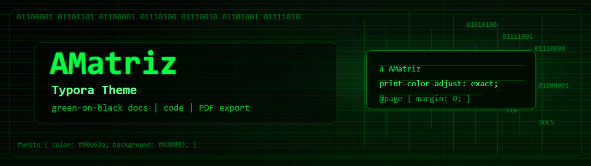

# AMatriz Typora Theme



AMatriz is a standalone Typora theme with a Matrix-inspired green-on-black visual style. It is built for engineering documentation, handoff notes, setup guides, and long-form technical writing where high contrast, readable code blocks, visible tables, and dependable PDF export matter.

## Current Version

- Version: `v1.0.0`
- Status: Complete and ready for Typora Theme Gallery submission
- Packaged theme CSS:
  - `coding/amatriz.css`
  - `coding/amatriz-print-white.css`
- Installed validation copies:
  - `%APPDATA%\Typora\themes\amatriz.css`
  - `%APPDATA%\Typora\themes\amatriz-print-white.css`
- `coding/` status: synchronized from the accepted Typora theme-folder copies for the v1.0.0 release package.

## Theme Variants

- `amatriz.css`: dark editor and dark PDF export.
- `amatriz-print-white.css`: same dark editor experience, but white PDF/print output with black default text.

Use the original AMatriz dark theme for screen reading, editor work, and dark reference PDFs. Use the white-print variant when the intended output is hardcopy printing or a white-background PDF for paper-style review.

Typora themes cannot add export-dialog toggles, so users choose the desired PDF output by selecting the matching theme before exporting.

## What It Provides

- Dark green-black editor background.
- Neon green body text with softer green secondary text.
- Styled headings, links, lists, task lists, blockquotes, tables, inline code, and fenced code blocks.
- Dark sidebar, Files panel, and Outline panel styling.
- Preferences and Export dialog styling coverage for common Typora UI containers.
- Dark PDF export support from `amatriz.css`.
- White PDF export support from `amatriz-print-white.css`.
- Print rules for A4-friendly margins, table borders, repeating table headers, code block panels, and Mermaid diagram sizing.

## Installation

1. Open Typora.
2. Go to Preferences -> Appearance -> Open Theme Folder.
3. Copy `amatriz.css` and `amatriz-print-white.css` into the theme folder.
4. Restart Typora.
5. Select `AMatriz` for dark PDF output or `AMatriz Print White` for white PDF output.

## License

MIT License. See `LICENSE`.

Copyright (c) 2026 Electritects Pty Ltd.

The license applies to the AMatriz theme source files and project assets in this repository. It does not impose licensing terms on Markdown documents, PDFs, notes, products, or services created with Typora while using the theme.

## PDF Export Behavior

`amatriz.css` exports a dark AMatriz PDF:

- Full dark page background.
- Green default Markdown text.
- Preserved inline HTML colors.
- Bordered code blocks and tables.
- Mermaid diagrams kept inside the printable page.

`amatriz-print-white.css` exports a printer-friendly white PDF:

- White page background on every page edge.
- Black default Markdown text.
- Blue links.
- Yellow highlight support.
- Light code panels with black text.
- Gray table and blockquote borders.
- Preserved authored inline HTML colors, such as `<span style="color: red;">red</span>`.

Both themes now use real `@page` margins instead of fake body padding, and table header rows are configured to repeat when a table spans pages.

The public theme CSS does not hard-code page breaks for the validation document. Repeatable pagination for `docs/Typora Test File v1.0.0.md` is stored in that Markdown file through explicit page-break markers.

## Validation Files

- `docs/Typora Test File v1.0.0.md` is the main A4 PDF validation/template file.
- `docs/Typora Test File v1.0.0 - PDF using Amatriz print white theme.pdf` is the white-export validation artifact.
- `docs/Typora Test File v1.0.0 - PDF using Amatriz theme.pdf` is the dark-export validation artifact.
- `docs/AMatriz Specifications v1.0.0.md` contains the detailed technical specification.
- `artwork/` contains gallery-ready artwork, including `amatriz.png` at 250x200 and `amatriz-500x400.png` at 500x400.

## Recommended Test Flow

1. Open `docs/Typora Test File v1.0.0.md` in Typora.
2. Select `AMatriz Print White`.
3. Export to PDF.
4. Confirm:
   - White background on every page edge.
   - Black default Markdown text.
   - Preserved inline HTML colors.
   - Yellow highlight remains visible.
   - Code blocks are single bordered panels.
   - Tables show full outside borders.
   - Mermaid diagram is not clipped.
   - No visible CSS or HTML helper text leaks into the PDF.

Repeat the flow with `AMatriz` to validate the dark PDF behavior.

Re-export both PDFs after changing either theme CSS file or the validation Markdown file.

## Release Source Files

The packaged release source files are:

```text
coding/amatriz.css
coding/amatriz-print-white.css
```

These files were copied from the installed Typora validation copies:

```text
%APPDATA%\Typora\themes\amatriz.css
%APPDATA%\Typora\themes\amatriz-print-white.css
```

## Publishing Checklist

- [x] Copy final CSS from Typora's theme folder into `coding/`.
- [x] Add or confirm the project license.
- [x] Confirm artwork files are present in `artwork/`.
- [x] Confirm the README and specifications match the final CSS.
- [x] Prepare the Typora Theme Gallery thumbnail and post staging files.
- [ ] Push the repository to GitHub and open a pull request to Typora's theme gallery.

## Typora Gallery Submission

Official Typora submission requirements are staged under `typora-theme-gallery-submission/`.

- Copy `typora-theme-gallery-submission/thumbnails/amatriz.png` into the gallery fork's `thumbnails/` directory.
- Copy `typora-theme-gallery-submission/_posts/theme/2026-06-01-amatriz.md` into the gallery fork's `_posts/theme/` directory.
- Publish this project repository or release ZIP, then replace the placeholder `homepage` and `download` URLs in the staged post before opening the pull request.

## Changelog

### v1.0.0

- Added `amatriz-print-white.css`.
- Kept the AMatriz editor dark in the white-print variant.
- Changed white-print PDF output to white background with black default text.
- Fixed black header/footer band behavior in white PDF export.
- Switched PDF layout to real `@page` margins.
- Preserved explicitly styled inline HTML colors in white-print output.
- Restored visible yellow highlight behavior.
- Fixed fenced code blocks so the border wraps the block rather than every line.
- Improved table borders and configured repeating table headers.
- Constrained Mermaid diagrams so they do not clip at the bottom of the page.
- Reworked `docs/Typora Test File v1.0.0.md` into an A4-oriented validation/template document with print-aware pagination.
- Moved validation-document page breaks out of theme CSS so the public theme remains document-independent.
- Added gallery artwork under `artwork/`.

### v1.0.0

- Established the original dark Matrix-inspired Typora theme.
- Added sidebar, outline, Preferences, and Export UI styling.
- Corrected dark PDF export with full-page dark background support.

## Known Limits

- PDF rendering can vary by Typora version, operating system, and print/PDF engine.
- Typora theme CSS cannot add custom controls, toggles, page-number controls, or PDF form fields.
- Header/footer/page-number behavior is primarily controlled by Typora/export settings, not the theme.
- Preferences and Export dialog internals may use Typora-version-specific classes.
- The theme intentionally uses system fonts and does not bundle external assets.
