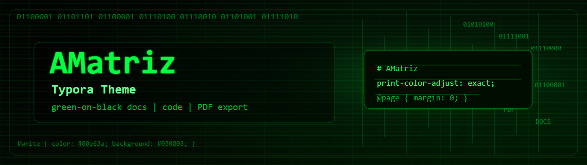

# AMatriz Typora Theme

AMatriz is a Typora theme system designed for engineering documentation, handoff notes, setup guides, and long-form technical writing.

It is not just a visual theme.  
It is a **deterministic document rendering system** built to ensure reliable, clean, and repeatable PDF output without manual layout intervention.

---

## Current Version

- **Version**: `v1.0.1`
- **Status**: Complete, stable, and ready for Typora Theme Gallery submission

### Packaged Theme Files
- [coding/amatriz.css](file:///c:/Users/eacca/Dropbox/Coding/Amatriz%20Typora%20Theme/coding/amatriz.css)
- [coding/amatriz-print-white.css](file:///c:/Users/eacca/Dropbox/Coding/Amatriz%20Typora%20Theme/coding/amatriz-print-white.css)

### Installed Validation Copies
- `%APPDATA%\Typora\themes\amatriz.css`  
- `%APPDATA%\Typora\themes\amatriz-print-white.css`  

The [coding/](file:///c:/Users/eacca/Dropbox/Coding/Amatriz%20Typora%20Theme/coding/) directory mirrors the validated Typora-installed versions used for release.

---

## Theme Variants

- **amatriz.css**
  - Dark editor
  - Dark PDF export

- **amatriz-print-white.css**
  - Dark editor
  - White PDF / print output with black default text

### Usage

- Use **AMatriz (dark)** for:
  - screen reading
  - engineering notes
  - dark PDF exports

- Use **AMatriz Print White** for:
  - printed documents
  - white-background PDFs
  - formal review distribution

---

## What It Provides

- Matrix-inspired dark UI with high contrast readability
- Structured typography for technical documents
- Styled elements:
  - headings
  - lists
  - blockquotes
  - tables
  - inline code
  - fenced code blocks
- Fully styled Typora UI (sidebar, outline, dialogs)
- Mermaid and Math rendering preserved in export

### Core System Capabilities (v1.0.1)

- Deterministic pagination (no layout randomness)
- No dependency on manual page breaks
- Clean multi-page code block splitting (no orphan lines)
- Table header repeat across pages
- Print-safe rendering (white and dark modes)
- Consistent behaviour across long documents

---

## Installation

1. Open Typora  
2. Go to **Preferences → Appearance → Open Theme Folder**  
3. Copy:
   - `amatriz.css`  
   - `amatriz-print-white.css`  
4. Restart Typora  
5. Select desired theme before exporting  

---

## PDF Export Behaviour

### amatriz.css (Dark Export)
- Full dark page background
- Green text
- Preserved inline HTML colors
- Styled code blocks and tables
- Math and Mermaid rendered correctly

### amatriz-print-white.css (White Export)
- Pure white page background
- Black default text
- Blue links
- Light code blocks
- Clear table borders
- Preserved inline HTML colors
- Math and Mermaid preserved

### Important

- Pagination is **fully CSS-driven**
- No hard-coded page breaks exist in the theme
- Documents render correctly without manual layout control

---

## Validation Files

- [docs/Typora Test File v1.0.0.md](file:///c:/Users/eacca/Dropbox/Coding/Amatriz%20Typora%20Theme/docs/Typora%20Test%20File%20v1.0.0.md) → Full validation dossier & baseline
- [docs/specs/AMatriz Specifications v1.0.1.md](file:///c:/Users/eacca/Dropbox/Coding/Amatriz%20Typora%20Theme/docs/specs/AMatriz%20Specifications%20v1.0.1.md) → Detailed technical specification
- [docs/assets/](file:///c:/Users/eacca/Dropbox/Coding/Amatriz%20Typora%20Theme/docs/assets/) → Documentation banner and assets
- [artwork/](file:///c:/Users/eacca/Dropbox/Coding/Amatriz%20Typora%20Theme/artwork/) → Gallery-ready artwork assets

Validation PDFs:
- [docs/Typora Test File v1.0.0 - PDF using Amatriz v1.0.1.pdf](file:///c:/Users/eacca/Dropbox/Coding/Amatriz%20Typora%20Theme/docs/Typora%20Test%20File%20v1.0.0%20-%20PDF%20using%20Amatriz%20v1.0.1.pdf) → Dark export (v1.0.1)  
- [docs/Typora Test File v1.0.0 - PDF using Amatriz white print v1.0.1.pdf](file:///c:/Users/eacca/Dropbox/Coding/Amatriz%20Typora%20Theme/docs/Typora%20Test%20File%20v1.0.0%20-%20PDF%20using%20Amatriz%20white%20print%20v1.0.1.pdf) → Print-white export (v1.0.1)  

These demonstrate:
- pagination stability  
- table behaviour  
- code block splitting  
- long-document robustness  

---

## Recommended Test Flow

1. Open the validation dossier ([docs/Typora Test File v1.0.0.md](file:///c:/Users/eacca/Dropbox/Coding/Amatriz%20Typora%20Theme/docs/Typora%20Test%20File%20v1.0.0.md)) in Typora
2. Select **AMatriz Print White**
3. Export to PDF

Verify:
- White page background on every page edge
- Black default text
- Inline HTML colors preserved
- Code blocks readable, styled, and correctly contained
- Tables:
  - full borders
  - header repetition on multi-page tables
- No clipping of Mermaid diagrams
- Math renders correctly
- No orphaned lines or broken sections

Repeat the flow using **AMatriz (dark)**.

---

## Release Source Files

Final release files:
- [coding/amatriz.css](file:///c:/Users/eacca/Dropbox/Coding/Amatriz%20Typora%20Theme/coding/amatriz.css)  
- [coding/amatriz-print-white.css](file:///c:/Users/eacca/Dropbox/Coding/Amatriz%20Typora%20Theme/coding/amatriz-print-white.css)  

---

## Publishing Checklist

- [x] Copy validated CSS into [coding/](file:///c:/Users/eacca/Dropbox/Coding/Amatriz%20Typora%20Theme/coding/)
- [x] Confirm README and specifications match the release
- [x] Verify artwork assets
- [x] Validate PDF exports
- [x] Upload and prepare Typora submission

---

## Typora Gallery Submission

- Use assets in [typora-theme-gallery-submission/](file:///c:/Users/eacca/Dropbox/Coding/Amatriz%20Typora%20Theme/typora-theme-gallery-submission/)
- Provide:
  - thumbnail: [typora-theme-gallery-submission/thumbnails/amatriz.png](file:///c:/Users/eacca/Dropbox/Coding/Amatriz%20Typora%20Theme/typora-theme-gallery-submission/thumbnails/amatriz.png)
  - theme post: [typora-theme-gallery-submission/_posts/theme/2026-06-01-amatriz.md](file:///c:/Users/eacca/Dropbox/Coding/Amatriz%20Typora%20Theme/typora-theme-gallery-submission/_posts/theme/2026-06-01-amatriz.md)
  - repository link

---

## License

[MIT License](file:///c:/Users/eacca/Dropbox/Coding/Amatriz%20Typora%20Theme/LICENSE)  
Copyright (c) 2026 Electritects Pty Ltd  

Applies to theme files only.  
Not to documents created using the theme.

---

## Changelog

### v1.0.1
- Introduced deterministic pagination system:
  - orphans / widows control
  - heading anchoring
  - controlled element breaking
- Eliminated need for manual page breaks
- Fixed multi-page code block splitting (no orphan lines)
- Ensured clean code continuation across pages
- Hardened table rendering for print (full borders, repeat headers)
- Fully separated screen vs print behaviour (scanline isolation)
- Improved inline code visibility and contrast
- Standardised print styling for:
  - tables
  - code blocks
  - blockquotes
- Stabilised long-document rendering across all content types
- Optimised editor width and readability

### v1.0.0
- Introduced AMatriz dark theme
- Added print-white variant
- Implemented:
  - white PDF output mode
  - table header repetition
  - Mermaid and Math export fixes
- Improved:
  - code block rendering
  - table borders
  - highlight behavior
- Moved pagination responsibility out of theme and into documents (initial approach)
- Created full validation test document

---

## Known Limits

- PDF rendering depends on the Typora engine and underlying OS
- Theme cannot control:
  - page numbers
  - headers/footers
  - export UI behaviour
- Fonts depend on system availability

---

## Final Note

AMatriz is built to ensure:

→ Documents **render correctly without manual intervention**  
→ Output is **consistent, predictable, and publishable**

This shifts Typora from a styling tool to a **document system**.
