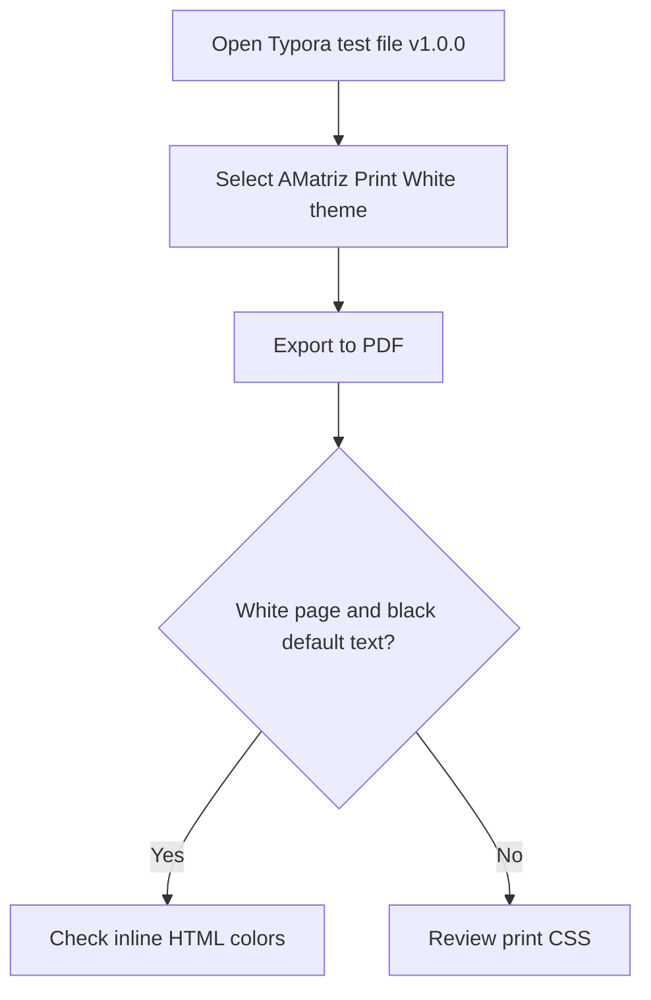

# AMatriz Typora Theme Validation Dossier v1.0.0

**Document type:** scholarly PDF export validation and typographic specimen  
**Theme variants:** `amatriz.css` and `amatriz-print-white.css`  
**Primary concern:** preservation of structure, legibility, color intent, and print fidelity

This dossier is a controlled test document for the AMatriz Typora theme family. It combines ordinary prose, scholarly apparatus, source code, mathematical notation, tables, multilingual samples, diagrams, footnotes, and print-aware pagination so the editor and PDF export pipelines can be evaluated against the same material.

[TOC]


## 1. Purpose and Scope

This document validates AMatriz v1.0.0, including the `amatriz.css` and `amatriz-print-white.css` theme variants. It is structured as an A4 PDF export template with print-aware pagination rules, allowing tables, diagrams, code blocks, equations, and reference material to be inspected under repeatable conditions.

Expected result when testing `amatriz-print-white.css`:

- The Typora editor remains the AMatriz dark green-on-black experience.
- The exported PDF page background is white.
- Default Markdown text prints black.
- Explicit inline HTML colors print in their authored colors.
- Links, code, tables, blockquotes, math, and diagrams remain readable on white paper.

Expected result when testing `amatriz.css`:

- The editor and exported PDF remain dark.
- AMatriz green text remains readable.
- Explicit inline HTML colors remain visible against the dark page.

## 2. Prose and Inline Formatting

This paragraph is intentionally plain Markdown. In `amatriz-print-white.css`, it prints as black text on a white page. In `amatriz.css`, it remains in the AMatriz dark scholarly palette. The passage also confirms that ordinary body copy reads as long-form documentation rather than as terminal output.

Inline formatting check: **bold text**, *italic text*, ***bold italic text***, ~~strikethrough text~~, `inline code`, [external link](https://typora.io), and <mark>highlighted text</mark>.

Keyboard-style HTML check: <kbd>Ctrl</kbd> + <kbd>S</kbd>

Editorial spacing check: this paragraph extends the prose sample with ordinary explanatory copy rather than artificial filler. It checks whether adjacent inline elements, punctuation, and sentence rhythm remain comfortable when the paragraph wraps across several lines in the exported PDF.

Scholarly apparatus check: short terms such as *rendering context*, **print fidelity**, and `theme override` should remain visually distinct without becoming loud. The point is to preserve typographic hierarchy while keeping body text quiet enough for long technical notes.


<div style="break-before: page; page-break-before: always;"></div>

## 3. Heading Hierarchy and Section Rhythm

This section starts at H2 because H1 is already used as the document title. The labels below are deliberately rendered as text rather than real headings so the Typora outline remains focused on the document's actual structure.

**H2 Scholarly Heading**

**H3 Subsection Heading**

**H4 Analytical Heading**

**H5 Minor Heading**

**H6 Marginal Heading**

This paragraph follows all heading levels so spacing, heading weight, and page-break behavior can be checked together.

## 4. Inline HTML Color Preservation

This section checks the key v1.0.0 requirement: default text prints black in the print-white variant, but explicitly styled inline HTML remains colored.

This text is <span style="color: red;">red</span> and this text is <span style="color: skyblue;">sky blue</span>.

Palette sentence: <span style="color: red;">red</span>, <span style="color: orange;">orange</span>, <span style="color: gold;">gold</span>, <span style="color: green;">green</span>, <span style="color: teal;">teal</span>, <span style="color: cyan;">cyan</span>, <span style="color: skyblue;">sky blue</span>, <span style="color: purple;">purple</span>, <span style="color: magenta;">magenta</span>, <span style="color: brown;">brown</span>, <span style="color: gray;">gray</span>, and normal default text.

CSS color formats: <span style="color: #ff0000;">hex red</span>, <span style="color: rgb(0, 128, 0);">RGB green</span>, <span style="color: hsl(197, 71%, 73%);">HSL sky blue</span>, and <span style="background: #fffbcc; color: #000000;">black text on yellow highlight</span>.

Color preservation matters because many technical notes use inline color to mark status, risk, or review state. The print-white theme should convert ordinary prose to black while preserving intentional inline colors supplied through HTML attributes or inline style declarations.

Contrast check: <span style="color: firebrick;">firebrick warning text</span>, <span style="color: seagreen;">seagreen pass text</span>, <span style="color: dodgerblue;">dodger blue reference text</span>, and <span style="color: darkorange;">dark orange caution text</span> remain authored colors in both exports. Unstyled words around them should follow the selected theme.

Mixed formatting check: <span style="color: purple;"><strong>bold purple annotation</strong></span>, <span style="color: teal;"><em>italic teal annotation</em></span>, and <span style="color: #444444; background: #fffbcc;">muted text on highlight</span> test nested inline emphasis without requiring raw CSS in the Markdown file.


<div style="break-before: page; page-break-before: always;"></div>

## 5. Lists

Lists verify indentation, wrapping, task boxes, and default text color. In white-print mode, list text is black unless an item contains explicit inline color.

### 5.1 Unordered List

- Top-level item A
  - Nested item A.1
    - Nested item A.1.a
  - Nested item A.2 with <span style="color: crimson;">crimson inline HTML</span>
- Top-level item B
- Top-level item C with `inline code` and **bold text**

### 5.2 Ordered List

1. First ordered item.
2. Second ordered item.
   1. Nested ordered item.
   2. Another nested ordered item.
3. Third ordered item with <span style="color: skyblue;">sky blue inline HTML</span>.

### 5.3 Task List

- [x] Completed task shows a clear checked state.
- [ ] Pending task shows an empty checkbox.
- [ ] Long pending task text wraps cleanly without colliding with the checkbox or adjacent lines.

## 6. Blockquotes

Blockquotes keep their left border. In white-print mode, the quote text is black and the border is gray.

> Root quote: the left border is visible and the quoted text remains readable.
>
> > Nested quote level 2 remains readable.
> >
> > > Nested quote level 3 stays distinct from the page background.


<div style="break-before: page; page-break-before: always;"></div>

## 7. Code Blocks

Code blocks print as one bordered block, not as a separate bordered box around every line.

### 7.1 Plain Text Fence

```text
AMatriz v1.0.0 plain text code block
print-white background: light
foreground: black
border: visible gray
```

### 7.2 CSS Fence

```css
:root {
  --amatriz-bg: #030803;
  --amatriz-fg: #00e63a;
  --amatriz-print-bg: #ffffff;
  --amatriz-print-fg: #000000;
}

@media print {
  body { background: #ffffff; color: #000000; }
}
```

### 7.3 JavaScript Fence

```js
const AMATRIZ_EXPORT_CHECKS = [
  "page-background",
  "body-text",
  "inline-colors",
  "tables",
  "math",
  "diagrams"
];

function renderThemeStatus(themeName, exportMode, checks = AMATRIZ_EXPORT_CHECKS) {
  const failures = checks.filter((check) => check.length === 0);

  return {
    themeName,
    exportMode,
    version: "v1.0.0",
    checkedAt: new Date().toISOString(),
    checks,
    readyForPdf: failures.length === 0
  };
}
```


<div style="break-before: page; page-break-before: always;"></div>

## 8. Tables

Tables verify that headers, cell backgrounds, borders, wrapped content, and page splits remain readable. The next table is intentionally long so the header row has to repeat when Typora exports across multiple PDF pages.

### 8.1 Table Header Repeat Stress Test

This table deliberately extends past one page. The theme repeats the header row on continuation pages and keeps the outside border visible.

| Area | What to Check | Expected `amatriz-print-white.css` Result |
| --- | --- | --- |
| Page background | Full PDF page behind text | White |
| Body text | Normal paragraphs and list items | Black |
| Inline HTML colors | `<span style="color: red;">red</span>` | Authored color preserved |
| Code blocks | Fenced code and inline code | Light gray fill, black text, gray border |
| Tables | Header, cells, borders | White/light gray cells, gray borders |
| Links | Inline and TOC links | Readable link color |
| Task lists | Checked and unchecked boxes | Clear visual state |
| Blockquotes | Nested quote levels | Gray left rules remain visible |
| Mermaid diagrams | Rendered SVG or canvas output | Diagram remains inside printable area |
| Math | Inline and block MathJax | Symbols remain readable |
| Footnotes | Footnote marker and definition | Marker and definition remain visible |
| Row 12 | Header repeat stress row | Continuation pages retain table headings |
| Row 13 | Header repeat stress row | Borders remain continuous |
| Row 14 | Header repeat stress row | Cell text wraps without clipping |
| Row 15 | Header repeat stress row | Long cells do not force page overflow |
| Row 16 | Header repeat stress row | Background colors remain print-safe |
| Row 17 | Header repeat stress row | Inline code remains legible |
| Row 18 | Header repeat stress row | Links stay visible |
| Row 19 | Header repeat stress row | Table row height remains stable |
| Row 20 | Header repeat stress row | No top border disappears at page breaks |
| Row 21 | Header repeat stress row | No bottom border disappears at page breaks |
| Row 22 | Header repeat stress row | Text remains aligned inside cells |
| Row 23 | Header repeat stress row | Header row repeats when needed |
| Row 24 | Header repeat stress row | Continuation page starts cleanly |
| Row 25 | Header repeat stress row | Table remains readable as a template |


### 8.2 Palette Table

| Color Name | Inline HTML Sample | Expected Print Result |
| --- | --- | --- |
| Red | <span style="color: red;">sample red text</span> | Red text |
| Orange | <span style="color: orange;">sample orange text</span> | Orange text |
| Yellow/Gold | <span style="color: gold;">sample gold text</span> | Gold text |
| Green | <span style="color: green;">sample green text</span> | Green text |
| Teal | <span style="color: teal;">sample teal text</span> | Teal text |
| Cyan | <span style="color: cyan;">sample cyan text</span> | Cyan text |
| Sky Blue | <span style="color: skyblue;">sample sky blue text</span> | Sky blue text |
| Deep Sky Blue | <span style="color: deepskyblue;">sample deep sky blue text</span> | Deep sky blue text |
| Purple | <span style="color: purple;">sample purple text</span> | Purple text |
| Violet | <span style="color: violet;">sample violet text</span> | Violet text |
| Magenta | <span style="color: magenta;">sample magenta text</span> | Magenta text |
| Brown | <span style="color: brown;">sample brown text</span> | Brown text |
| Gray | <span style="color: gray;">sample gray text</span> | Gray text |
| Firebrick | <span style="color: firebrick;">sample firebrick text</span> | Firebrick text |
| Black default | normal Markdown text | Black text in print-white output |

Text colors can be defined with named colors such as `skyblue`, hexadecimal values such as `#87ceeb`, RGB values such as `rgb(135, 206, 235)`, or HSL values such as `hsl(197, 71%, 73%)`. The print-white theme preserves authored inline color while converting unstyled Markdown text to black.


<div style="break-before: page; page-break-before: always;"></div>

## 9. Math

Math checks that Typora/MathJax output remains visible after the print overrides, including compact reference equations that often appear in technical notes.

### 9.1 Symbols and Integrals

Inline notation keeps superscripts, subscripts, radicals, and constants readable: E = mc<sup>2</sup>, x<sub>i</sub> + y<sub>i</sub> = z<sub>i</sub>, √144 = 12, and N<sub>A</sub> = 6.02214076 x 10<sup>23</sup> mol<sup>-1</sup>.

$$
\int_0^1 x^2\,dx=\frac{1}{3},\quad
\iint_R (x+y)\,dA,\quad
\iiint_V \rho\,dV,\quad
\oint_C \mathbf{F}\cdot d\mathbf{r}
$$

Limit and series checks:

$$
\lim_{x\to 0}\frac{\sin x}{x}=1,\quad
\lim_{n\to\infty}\left(1+\frac{1}{n}\right)^n=e
$$

$$
e^x=\sum_{n=0}^{\infty}\frac{x^n}{n!},\quad
\sum_{k=1}^{\infty}\frac{1}{k^2}=\frac{\pi^2}{6}
$$

### 9.2 Matrix Multiplication

$$
\begin{bmatrix}
1 & 2 & 3 \\
0 & 1 & 4 \\
5 & 6 & 0
\end{bmatrix}
\begin{bmatrix}
7 & 8 & 9 \\
2 & 3 & 4 \\
1 & 0 & 6
\end{bmatrix}
=
\begin{bmatrix}
14 & 14 & 35 \\
6 & 3 & 28 \\
47 & 58 & 69
\end{bmatrix}
$$

### 9.3 Physics Equations

Stokes' theorem and Lorentz transform:

$$
\oint_{\partial S}\mathbf{F}\cdot d\mathbf{r}=\iint_S(\nabla\times\mathbf{F})\cdot\mathbf{n}\,dS,\qquad
x'=\gamma(x-vt), \qquad t'=\gamma\left(t-\frac{vx}{c^2}\right)
$$

Maxwell equations and Schrodinger equation:

$$
\begin{aligned}
\nabla\cdot\mathbf{E}&=\frac{\rho}{\epsilon_0},&
\nabla\cdot\mathbf{B}&=0\\
\nabla\times\mathbf{E}&=-\frac{\partial\mathbf{B}}{\partial t},&
\nabla\times\mathbf{B}&=\mu_0\mathbf{J}+\mu_0\epsilon_0\frac{\partial\mathbf{E}}{\partial t}\\
i\hbar\frac{\partial}{\partial t}\Psi&=\hat{H}\Psi
\end{aligned}
$$

$$
\begin{array}{c}
U\\
\hline
R\mid I\\[0.75em]
U = R I \qquad I = \frac{U}{R} \qquad R = \frac{U}{I}
\end{array}
$$


<div style="break-before: page; page-break-before: always;"></div>

## 10. Units, Metrics, and Conversions

This section checks dense technical reference text and tables using metric, US customary, mass, weight, and force values.

<table class="amatriz-technical-table">
<thead>
<tr><th>Quantity</th><th>Metric / SI</th><th>US Customary</th><th>Notes</th></tr>
</thead>
<tbody>
<tr><td>Length</td><td>1 m</td><td>3.28084 ft</td><td>meter to feet</td></tr>
<tr><td>Length</td><td>1 km</td><td>0.621371 mi</td><td>kilometer to mile</td></tr>
<tr><td>Area</td><td>1 m^2</td><td>10.7639 ft^2</td><td>square meter to square feet</td></tr>
<tr><td>Volume</td><td>1 L</td><td>0.264172 gal</td><td>liter to US gallon</td></tr>
<tr><td>Mass</td><td>1 kg</td><td>2.20462 lbm</td><td>kilogram to pound-mass</td></tr>
<tr><td>Weight / force</td><td>1 N</td><td>0.224809 lbf</td><td>newton to pound-force</td></tr>
<tr><td>Torque</td><td>1 N*m</td><td>0.737562 lbf*ft</td><td>newton-meter to pound-foot</td></tr>
<tr><td>Pressure</td><td>1 kPa</td><td>0.145038 psi</td><td>kilopascal to psi</td></tr>
<tr><td>Energy</td><td>1 J</td><td>0.737562 ft*lbf</td><td>joule to foot-pound</td></tr>
<tr><td>Power</td><td>1 kW</td><td>1.34102 hp</td><td>kilowatt to horsepower</td></tr>
<tr><td>Temperature</td><td>0 deg C</td><td>32 deg F</td><td>freezing point of water</td></tr>
<tr><td>Density</td><td>1 kg/m^3</td><td>0.062428 lb/ft^3</td><td>SI density to customary density</td></tr>
<tr><td>Flow</td><td>1 L/min</td><td>0.264172 gal/min</td><td>volumetric flow conversion</td></tr>
<tr><td>Speed</td><td>100 km/h</td><td>62.1371 mph</td><td>road speed conversion</td></tr>
</tbody>
</table>

<table class="amatriz-technical-table">
<thead>
<tr><th>Constant / reference</th><th>Metric value</th><th>Notes</th></tr>
</thead>
<tbody>
<tr><td>Speed of light</td><td>299,792,458 m/s</td><td>exact SI definition</td></tr>
<tr><td>Planck constant</td><td>6.62607015 x 10^-34 J*s</td><td>exact SI definition</td></tr>
<tr><td>Avogadro constant</td><td>6.02214076 x 10^23 mol^-1</td><td>exact SI definition</td></tr>
<tr><td>Standard gravity</td><td>9.80665 m/s^2</td><td>conventional acceleration for weight calculations</td></tr>
<tr><td>Gas constant</td><td>8.314462618 J/(mol*K)</td><td>molar ideal gas constant</td></tr>
<tr><td>Standard atmosphere</td><td>101.325 kPa</td><td>sea-level reference pressure</td></tr>
<tr><td>Euler's number</td><td>e = 2.718281828459...</td><td>natural logarithm base</td></tr>
<tr><td>Light-year</td><td>9.4607304725808 x 10^15 m</td><td>distance light travels in one Julian year</td></tr>
<tr><td>Mean Earth radius</td><td>6,371 km</td><td>approximate geophysical reference</td></tr>
<tr><td>Earth to Sun</td><td>149,597,870.7 km</td><td>one astronomical unit</td></tr>
<tr><td>Water density</td><td>about 997 kg/m^3</td><td>liquid water near room temperature</td></tr>
</tbody>
</table>

Mass is a quantity of matter, while weight is a force caused by gravity. A 10 kg mass weighs about 98.1 N on Earth using F = ma with a = 9.81 m/s<sup>2</sup>. The theme keeps units, symbols, mathematical notation, and table borders readable on both dark and white PDF exports.


<div style="break-before: page; page-break-before: always;"></div>

## 11. Chemistry

Chemistry checks subscripts, superscripts, reaction arrows, compact tables, and simple structural notation.

<table class="amatriz-chemistry-table">
<thead>
<tr><th>Formula</th><th>Name</th><th>Notes</th></tr>
</thead>
<tbody>
<tr><td>H<sub>2</sub>O</td><td>Water</td><td>two hydrogen atoms and one oxygen atom</td></tr>
<tr><td>HCl</td><td>Hydrogen chloride</td><td>hydrogen plus chlorine; H = 1.008, Cl = 35.45</td></tr>
<tr><td>CH<sub>4</sub></td><td>Methane</td><td>first alkane hydrocarbon</td></tr>
<tr><td>C<sub>2</sub>H<sub>6</sub></td><td>Ethane</td><td>saturated hydrocarbon</td></tr>
<tr><td>C<sub>3</sub>H<sub>8</sub></td><td>Propane</td><td>fuel gas example</td></tr>
<tr><td>C<sub>6</sub>H<sub>6</sub></td><td>Benzene</td><td>cyclic aromatic hydrocarbon</td></tr>
<tr><td>Li<sup>+</sup></td><td>Lithium ion</td><td>charge carrier in lithium-ion cells</td></tr>
<tr><td>LiCoO<sub>2</sub></td><td>Lithium cobalt oxide</td><td>layered cathode material</td></tr>
<tr><td>LiFePO<sub>4</sub></td><td>Lithium iron phosphate</td><td>stable phosphate battery cathode</td></tr>
<tr><td>LiPF<sub>6</sub></td><td>Lithium hexafluorophosphate</td><td>common electrolyte salt</td></tr>
<tr><td>Cu</td><td>Copper</td><td>high-conductivity electrical cable metal</td></tr>
<tr><td>Al</td><td>Aluminium</td><td>lightweight conductor for overhead lines</td></tr>
<tr><td>Cu-Zn</td><td>Brass</td><td>copper alloy used in fittings and contacts</td></tr>
<tr><td>Al-Mg-Si</td><td>Aluminium alloy</td><td>structural and conductor alloy family</td></tr>
<tr><td>Fe-C</td><td>Carbon steel</td><td>iron-carbon alloy for structural use</td></tr>
<tr><td>Sn-Ag-Cu</td><td>Lead-free solder</td><td>electronics interconnect alloy</td></tr>
</tbody>
</table>

Compact periodic table:

<table class="periodic-mini">
<thead><tr><th>1</th><th>2</th><th>3</th><th>4</th><th>5</th><th>6</th><th>7</th><th>8</th><th>9</th><th>10</th><th>11</th><th>12</th><th>13</th><th>14</th><th>15</th><th>16</th><th>17</th><th>18</th></tr></thead>
<tbody>
<tr><td>H</td><td colspan="16"></td><td>He</td></tr>
<tr><td>Li</td><td>Be</td><td colspan="10"></td><td>B</td><td>C</td><td>N</td><td>O</td><td>F</td><td>Ne</td></tr>
<tr><td>Na</td><td>Mg</td><td colspan="10"></td><td>Al</td><td>Si</td><td>P</td><td>S</td><td>Cl</td><td>Ar</td></tr>
<tr><td>K</td><td>Ca</td><td>Sc</td><td>Ti</td><td>V</td><td>Cr</td><td>Mn</td><td>Fe</td><td>Co</td><td>Ni</td><td>Cu</td><td>Zn</td><td>Ga</td><td>Ge</td><td>As</td><td>Se</td><td>Br</td><td>Kr</td></tr>
<tr><td>Rb</td><td>Sr</td><td>Y</td><td>Zr</td><td>Nb</td><td>Mo</td><td>Tc</td><td>Ru</td><td>Rh</td><td>Pd</td><td>Ag</td><td>Cd</td><td>In</td><td>Sn</td><td>Sb</td><td>Te</td><td>I</td><td>Xe</td></tr>
<tr><td>Cs</td><td>Ba</td><td>La*</td><td>Hf</td><td>Ta</td><td>W</td><td>Re</td><td>Os</td><td>Ir</td><td>Pt</td><td>Au</td><td>Hg</td><td>Tl</td><td>Pb</td><td>Bi</td><td>Po</td><td>At</td><td>Rn</td></tr>
<tr><td>Fr</td><td>Ra</td><td>Ac*</td><td>Rf</td><td>Db</td><td>Sg</td><td>Bh</td><td>Hs</td><td>Mt</td><td>Ds</td><td>Rg</td><td>Cn</td><td>Nh</td><td>Fl</td><td>Mc</td><td>Lv</td><td>Ts</td><td>Og</td></tr>
<tr><td colspan="2">Ln</td><td colspan="16">Ce Pr Nd Pm Sm Eu Gd Tb Dy Ho Er Tm Yb Lu</td></tr>
<tr><td colspan="2">Ac</td><td colspan="16">Th Pa U Np Pu Am Cm Bk Cf Es Fm Md No Lr</td></tr>
</tbody>
</table>

Balanced reactions and notation:

2H<sub>2</sub> + O<sub>2</sub> -> 2H<sub>2</sub>O  
CH<sub>4</sub> + 2O<sub>2</sub> -> CO<sub>2</sub> + 2H<sub>2</sub>O  
Ca<sup>2+</sup> + CO<sub>3</sub><sup>2-</sup> -> CaCO<sub>3</sub>  
Balancing exercise: Fe + O<sub>2</sub> -> Fe<sub>2</sub>O<sub>3</sub> becomes 4Fe + 3O<sub>2</sub> -> 2Fe<sub>2</sub>O<sub>3</sub>.


<div style="break-before: page; page-break-before: always;"></div>

## 12. Mermaid Diagram

The Mermaid block checks whether rendered diagrams stay centered, readable, and inside the printable area.




<div style="break-before: page; page-break-before: always;"></div>

## 13. Long Lists and Page Break Stress

This section checks ordinary long-form document behavior without letting the stress content damage the published PDF layout.

### 13.1 Long Paragraphs

AMatriz is intended for engineering notes, build logs, setup procedures, API references, and handoff documents. These documents often contain dense text with many inline code spans such as `npm install`, `git status`, `@media print`, and `print-color-adjust: exact`. In v1.0.0, the original AMatriz theme preserves the dark PDF output, while `amatriz-print-white.css` gives users a printer-friendly white output without changing the dark editor experience.

The print-white variant avoids overly narrow content, clipped right edges, washed-out text, and forced dark backgrounds. This paragraph prints as normal black text, while this inline color sample remains <span style="color: firebrick;">firebrick</span>.

### 13.2 Long Bullet List

- Check the first page background.
- Check the TOC links and indentation.
- Check whether H1 through H6 headings are visually distinct.
- Check whether inline code remains readable.
- Check whether fenced code blocks keep their panel and border.
- Check whether table borders are visible.
- Check whether blockquote borders are visible.
- Check whether task checkboxes are visible.
- Check whether math renders without color clashes.
- Check whether Mermaid output is readable.
- Check whether inline HTML colors survive PDF export.

### 13.3 Numbered List

1. First numbered item.
2. Second numbered item.
3. Third numbered item.
4. Fourth numbered item.

### 13.4 Alphabetical and Roman Lists

a. Alpha item using an alphabetical marker.
b. Beta item using an alphabetical marker.
c. Gamma item using an alphabetical marker.

i. Roman item one.
ii. Roman item two.
iii. Roman item three.

### 13.5 Final Export Checklist

- [x] Editor remains dark before export.
- [x] PDF page background is white when using `amatriz-print-white.css`.
- [x] Default Markdown text is black.
- [x] Explicit inline HTML colors print in color.
- [x] Code blocks are bordered and readable.
- [x] Tables are readable and show their full outside border.
- [x] Table header rows repeat when a table spans multiple pages.
- [x] TOC is readable.
- [x] No major content is clipped.
- [x] No heading is stranded at the bottom of a page.

### 13.6 Footnotes

This sentence includes a footnote for export testing.[^amatriz-print-white] This sentence checks a second footnote marker.[^table-repeat] This one checks Mermaid commentary.[^mermaid-export] Unicode text has its own note.[^unicode-fonts] Units and equations have a final note.[^units-math]

[^amatriz-print-white]: Footnotes print as readable text on white paper in `amatriz-print-white.css`.
[^table-repeat]: Table headers repeat when the table spans a PDF page boundary.
[^mermaid-export]: Mermaid output is rendered by Typora before export, then constrained by the theme.
[^unicode-fonts]: Unicode visibility depends partly on fonts available to Typora and the operating system.
[^units-math]: Unit conversions and equations preserve inline code, math notation, and table borders.


<div style="break-before: page; page-break-before: always;"></div>

## 14. Unicode

Unicode checks whether multilingual scripts remain visible in exported PDFs. The table below is a rendering sample for "I love you" across different scripts and writing systems.

<table class="amatriz-unicode-table">
<thead>
<tr><th>Language / Script</th><th>Text</th></tr>
</thead>
<tbody>
<tr><td>Chinese Simplified</td><td>&#25105;&#29233;&#20320;</td></tr>
<tr><td>Japanese</td><td>&#24859;&#12375;&#12390;&#12356;&#12414;&#12377;</td></tr>
<tr><td>Korean</td><td>&#49324;&#46993;&#54644;&#50836;</td></tr>
<tr><td>Hindi</td><td>&#2350;&#2376;&#2306; &#2340;&#2369;&#2350;&#2360;&#2375; &#2346;&#2381;&#2351;&#2366;&#2352; &#2325;&#2352;&#2340;&#2366; &#2361;&#2370;&#2305;</td></tr>
<tr><td>Arabic</td><td>&#1571;&#1581;&#1576;&#1603;</td></tr>
<tr><td>Russian Cyrillic</td><td>&#1071; &#1090;&#1077;&#1073;&#1103; &#1083;&#1102;&#1073;&#1083;&#1102;</td></tr>
<tr><td>Greek</td><td>&#931;&#949; &#945;&#947;&#945;&#960;&#974;</td></tr>
<tr><td>Armenian</td><td>&#1333;&#1405; &#1412;&#1381;&#1382; &#1405;&#1387;&#1408;&#1400;&#1410;&#1396; &#1381;&#1396;</td></tr>
<tr><td>Amharic</td><td>&#4773;&#4840;&#4853;&#4627;&#4632;&#4621;</td></tr>
<tr><td>Hebrew</td><td>&#1488;&#1504;&#1497; &#1488;&#1493;&#1492;&#1489; &#1488;&#1493;&#1514;&#1498;</td></tr>
<tr><td>Thai</td><td>&#3593;&#3633;&#3609;&#3619;&#3633;&#3585;&#3588;&#3640;&#3603;</td></tr>
<tr><td>Georgian</td><td>&#4315;&#4312;&#4327;&#4309;&#4304;&#4320;&#4334;&#4304;&#4320;</td></tr>
<tr><td>Ukrainian Cyrillic</td><td>&#1071; &#1090;&#1077;&#1073;&#1077; &#1082;&#1086;&#1093;&#1072;&#1102;</td></tr>
<tr><td>Serbian Cyrillic</td><td>&#1042;&#1086;&#1083;&#1080;&#1084; &#1090;&#1077;</td></tr>
<tr><td>Bulgarian Cyrillic</td><td>&#1054;&#1073;&#1080;&#1095;&#1072;&#1084; &#1090;&#1077;</td></tr>
<tr><td>Persian</td><td>&#1583;&#1608;&#1587;&#1578;&#1578; &#1583;&#1575;&#1585;&#1605;</td></tr>
<tr><td>Urdu</td><td>&#1605;&#1740;&#1722; &#1578;&#1605; &#1587;&#1746; &#1605;&#1581;&#1576;&#1578; &#1705;&#1585;&#1578;&#1575; &#1729;&#1608;&#1722;</td></tr>
<tr><td>Tamil</td><td>&#2984;&#3006;&#2985;&#3021; &#2953;&#2985;&#3021;&#2985;&#3016; &#2965;&#3006;&#2980;&#2994;&#3007;&#2965;&#3021;&#2965;&#3007;&#2993;&#3015;&#2985;&#3021;</td></tr>
<tr><td>Telugu</td><td>&#3112;&#3143;&#3112;&#3137; &#3112;&#3135;&#3112;&#3149;&#3112;&#3137; &#3114;&#3149;&#3120;&#3143;&#3118;&#3135;&#3128;&#3149;&#3108;&#3137;&#3112;&#3149;&#3112;&#3134;&#3112;&#3137;</td></tr>
<tr><td>Bengali</td><td>&#2438;&#2478;&#2495; &#2468;&#2507;&#2478;&#2494;&#2453;&#2503; &#2477;&#2494;&#2482;&#2507;&#2476;&#2494;&#2488;&#2495;</td></tr>
<tr><td>Khmer</td><td>Khmer sample: &#6017;&#6098;&#6025;&#6075;&#6086;&#6047;&#6082;&#6040;&#6070;&#6025;&#6086;&#6047;&#6016;</td></tr>
<tr><td>Lao</td><td>Lao sample: &#3714;&#3785;&#3719;&#3762;&#3745;&#3762;&#3713;&#3760;&#3719;&#3765;&#3785;&#3762;</td></tr>
<tr><td>Burmese</td><td>Burmese sample: &#4121;&#4100;&#4154;&#4152;&#4096;&#4141;&#4143;&#4097;&#4155;&#4101;&#4154;&#4112;&#4122;&#4154;</td></tr>
<tr><td>Sinhala</td><td>Sinhala sample: &#3512;&#3512; &#3476;&#3514;&#3535;&#3495; &#3462;&#3503;&#3515;&#3545;&#3514;&#3538;</td></tr>
<tr><td>Vietnamese</td><td>T&ocirc;i y&ecirc;u b&#7841;n</td></tr>
</tbody>
</table>

Accent samples: &uuml; &Uuml;, &ouml; &Ouml;, &auml; &Auml;, &eacute; &egrave; &ecirc; &euml;, &agrave; &acirc; &aelig; &ccedil;, &ntilde; &Ntilde;, &oslash; &Oslash;, &aring; &Aring;.

Compact verb sample:

<table class="amatriz-unicode-table">
<thead>
<tr><th>Language</th><th>Verb "to be" present sample</th></tr>
</thead>
<tbody>
<tr><td>English</td><td>am; are; is; are</td></tr>
<tr><td>French</td><td>suis; es; est; sommes; &ecirc;tes; sont</td></tr>
<tr><td>German</td><td>bin; bist; ist; sind; seid; sind</td></tr>
<tr><td>Portuguese</td><td>sou/estou; &eacute;s/est&aacute;s; &eacute;/est&aacute;; somos/estamos</td></tr>
<tr><td>Spanish</td><td>soy/estoy; eres/est&aacute;s; es/est&aacute;; somos/estamos</td></tr>
<tr><td>Italian</td><td>sono; sei; &egrave;; siamo; siete; sono</td></tr>
</tbody>
</table>


<div style="break-before: page; page-break-before: always;"></div>

## 15. Scholarly Discussion: Document Engineering and Print Fidelity

### 15.1 Abstract

This document may be viewed not merely as a theme validation artifact, but as a controlled experiment in digital document engineering. The objective is to evaluate whether a Markdown-based authoring workflow can preserve semantic structure, visual hierarchy, accessibility, mathematical notation, code presentation, multilingual content, and print fidelity across different rendering contexts.

### 15.2 Research Context

Modern technical communication increasingly relies on lightweight markup languages such as Markdown. Their adoption has accelerated within software engineering, scientific publishing, infrastructure documentation, knowledge management systems, and academic note-taking environments. A recurring challenge is ensuring consistency between:

1. Authoring environment.
2. Screen presentation.
3. PDF export.
4. Printed output.

The AMatriz theme architecture represents a practical case study in separating authoring aesthetics from publication aesthetics through targeted print-specific cascading style sheets (CSS).

### 15.3 Methodological Considerations

The validation strategy implemented throughout this document follows several quality-assurance principles:

| Principle | Purpose |
|------------|------------|
| Functional Validation | Verify expected rendering behaviour |
| Regression Testing | Detect changes between versions |
| Stress Testing | Evaluate long tables and complex layouts |
| Accessibility Testing | Assess readability and contrast |
| Internationalization Testing | Verify multilingual support |
| Mathematical Verification | Confirm equation rendering |
| Diagram Validation | Confirm Mermaid export integrity |

### 15.4 Limitations

No single export test can guarantee rendering consistency across all operating systems, browsers, PDF engines, fonts, and printer drivers. Consequently, exported artifacts should be evaluated on representative deployment environments prior to formal publication.

### 15.5 Recommendations for Future Development

Future versions may consider:

- Automated PDF regression testing.
- Accessibility compliance measurement.
- Color-blindness simulation workflows.
- Automated typography scoring.
- Citation and bibliography support.
- Academic publishing templates.
- ISO-style technical documentation templates.


## 16. Conclusion

The AMatriz validation document demonstrates a comprehensive framework for evaluating Markdown-to-PDF publication workflows. Through structured testing of typography, tables, mathematics, diagrams, code blocks, multilingual content, and print-specific styling, the document provides a reproducible benchmark suitable for technical documentation environments, engineering teams, software projects, and research-oriented publishing workflows.

The broader significance extends beyond theme validation. The document serves as an example of how lightweight markup systems can be used to create maintainable, version-controlled, and publication-ready technical artifacts while preserving readability across digital and printed media.

Copyright (c) 2026 Electritects Pty Ltd.
